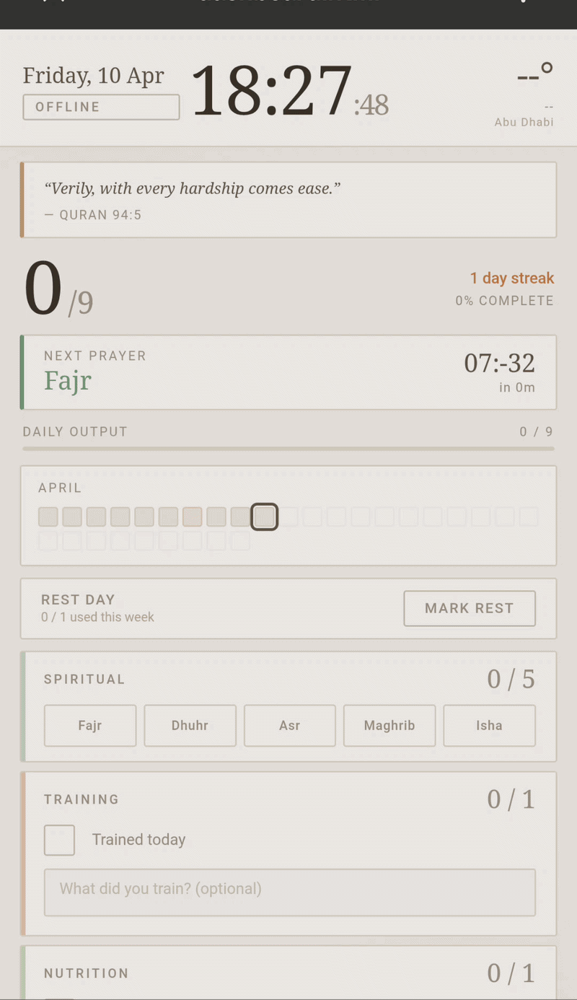

# Habit Dashboard PWA

Personal productivity dashboard that scores your day across prayer, training, nutrition, and study — auto-logs to Google Calendar at 11:30pm.

## Tech Stack
- HTML, CSS, JavaScript (vanilla, no frameworks)
- Web Audio API
- Open-Meteo API (live weather, no key required)
- PWA / GitHub Pages

## What it demonstrates
A dependency-free personal tool built for real daily use — mounted as an always-on iPhone dashboard at home. Features prayer time calculation from coordinates, streak tracking with milestone rewards (7/21/66/90 days), sound feedback, and offline support.

## How to run
1. Fork this repo
2. Settings → Pages → Deploy from `main` branch
3. Open the GitHub Pages URL in Safari on iPhone → Share → Add to Home Screen
4. Set Auto-Lock to Never and keep plugged in

To adjust for a different city, update the coordinates in `index.html`.

**[Live Demo](https://ahmedshehata2002.github.io/habit-dashboard)**
